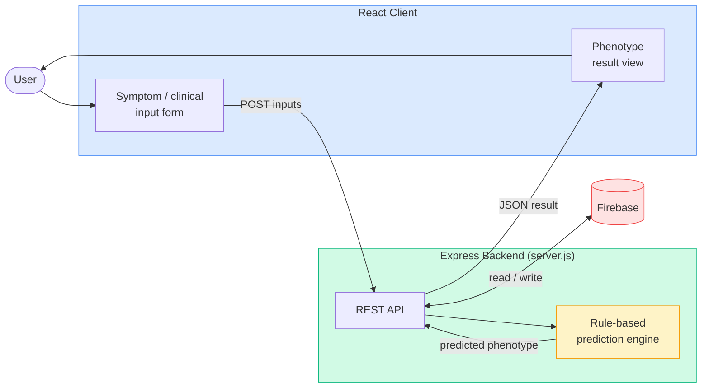
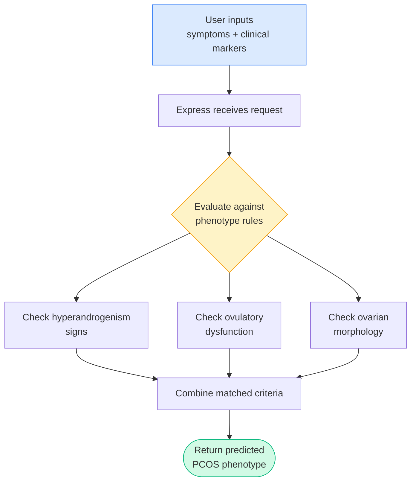

 <div align="center">

# PCOS Sync

### A PCOS Phenotype Prediction System

**A web app that predicts PCOS (Polycystic Ovary Syndrome) phenotypes from clinical and symptom inputs using a rule-based engine, with a React frontend and an Express + Firebase backend.**

[](https://nodejs.org/)
[](https://expressjs.com/)
[](https://react.dev/)
[](https://firebase.google.com/)
[](https://developer.mozilla.org/docs/Web/JavaScript)

</div>

> **Disclaimer:** This project is for educational and informational purposes only. It is **not** a medical device and does not provide a clinical diagnosis. Always consult a qualified healthcare professional for any medical concerns.

---

## Table of Contents

- [Overview](#overview)
- [How It Works](#how-it-works)
- [Tech Stack](#tech-stack)
- [Architecture](#architecture)
- [Prediction Flow](#prediction-flow)
- [Getting Started](#getting-started)
- [Project Structure](#project-structure)
- [API](#api)
- [Configuration](#configuration)
- [Roadmap](#roadmap)
- [License](#license)

---

## Overview

PCOS presents in different **phenotypes** (commonly grouped A–D based on the Rotterdam criteria, combining signs like hyperandrogenism, ovulatory dysfunction, and polycystic ovarian morphology). Identifying a likely phenotype helps frame the right questions for a clinician.

**PCOS Sync** collects a user's clinical and symptom inputs through a React interface, sends them to an Express backend, and applies a **rule-based engine** to predict the most likely PCOS phenotype. Firebase is used for data storage.

---

## How It Works

1. The user fills out a form in the React client (symptoms, clinical markers, etc.).
2. The client sends the inputs to the Express backend.
3. The backend runs **rule-based logic** in `server.js` to evaluate the inputs against phenotype criteria.
4. A predicted phenotype (and supporting details) is returned to the client and displayed.
5. Relevant data is persisted via Firebase.

---

## Tech Stack

| Layer | Technology |
|---|---|
| **Frontend** | React (in `client/`) |
| **Backend** | Node.js · Express 4 |
| **Prediction** | Rule-based engine (`server.js`) |
| **Database** | Firebase 11 |
| **Utilities** | CORS · dotenv |
| **Dev** | nodemon |

---

## Architecture



---

## Prediction Flow



> The exact rules live in `server.js`. Adjust the diagram above to match your real criteria if they differ.

---

## Getting Started

### Prerequisites

- Node.js 18+ and npm
- A Firebase project (for the database config)

### 1. Clone the repository

```bash
git clone https://github.com/aydee-akash/pcos-sync.git
cd pcos-sync
```

### 2. Install backend dependencies

```bash
npm install
```

### 3. Install frontend dependencies

```bash
cd client
npm install
cd ..
```

### 4. Configure environment

Create a `.env` file in the project root and add your Firebase / app config:

```bash
# .env
PORT=5000
# Firebase config
FIREBASE_API_KEY=your_key_here
FIREBASE_PROJECT_ID=your_project_id
# ...add the rest of your Firebase keys
```

### 5. Run the backend

```bash
npm run dev      # with nodemon (auto-reload)
# or
npm start        # plain node
```

### 6. Run the frontend

```bash
cd client
npm start
```

Then open the client in your browser (typically `http://localhost:3000`).

---

## Project Structure

```
pcos-sync/
├── client/                 # React frontend
│   └── src/                # Components, form, result views
├── server.js               # Express server + rule-based prediction engine
├── test-compare-api.js     # Script to test the compare/predict API
├── package.json            # Backend dependencies & scripts
├── package-lock.json
└── .gitignore
```

---

## API

The backend exposes a REST API consumed by the React client. A test script, `test-compare-api.js`, is included to exercise the prediction/compare endpoint.

```bash
node test-compare-api.js
```

> Document your actual routes here, for example:
>
> | Method | Endpoint | Description |
> |---|---|---|
> | `POST` | `/api/predict` | Submit inputs, get predicted phenotype |
> | `POST` | `/api/compare` | Compare inputs against phenotype criteria |
>
> Replace these with the real endpoints defined in `server.js`.

---

## Configuration

| Variable | Description | Required |
|---|---|---|
| `PORT` | Port the Express server runs on | Optional |
| `FIREBASE_*` | Firebase project configuration keys | Yes |

Environment variables are loaded via **dotenv** from a `.env` file in the project root. Never commit `.env` to version control.

---

## Roadmap

- [ ] Expand and validate the rule set against published PCOS phenotype criteria
- [ ] Add input validation and clearer result explanations
- [ ] User accounts and saved history (via Firebase Auth)
- [ ] Replace/augment rules with a trained ML model
- [ ] Automated test coverage for the prediction logic

---

## License

No license file is currently included in the repository. If you intend this to be open source, consider adding a `LICENSE` file (for example, the MIT License).

<div align="center">

---

*Built as a PCOS phenotype prediction prototype. Not a substitute for professional medical advice.*

</div>
